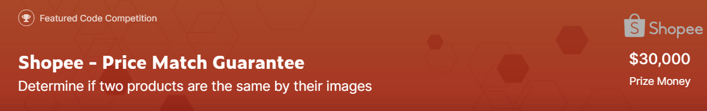

# Shopee 2021 Competition

This project was created to develop the best model to win the Shopee - Price Math Guarantee competition at [Kaggle](https://www.kaggle.com/c/shopee-product-matching/overview)

## Main dependencies
- pandas
- numpy
- matplotlib
- pytorch
- opencv

## How to start a project
1.First of all clone the repository using the following [link](https://github.com/DenisioMytnysiano/Shopee-2021-Competition) </br>
2.Open cmd or bash in home directory and install pipenv using following command
```bash
foo@bar:~$ pip install poetry
```
3.Open the project folder, create virtual environment and install dependencies
```bash
foo@bar:~$ poetry shell
foo@bar:~$ poetry install
```
4.If you don't want to install developer dependencies
```bash
foo@bar:~$ poetry install --no-dev
```


